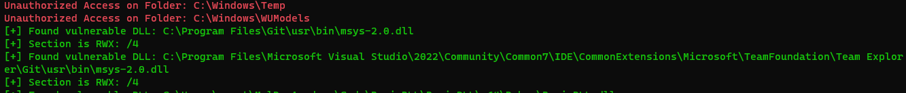

# jrwxfinder
Whether you knew [Process Mockingkay](https://www.securityjoes.com/post/process-mockingjay-echoing-rwx-in-userland-to-achieve-code-execution) since [ever](https://twitter.com/namazso/status/1673730153065725965) or you just got to know it, this tool helps you to find DLLs with RWX section. This is done parsing the PE Section Headers and checking the "Characteristics" attribute of each section.   

## Disclaimer
It's not a great code, just copy pasta of an old project I had written for learning about PE structure. 

## Usage
Pretty straightforward: 

```
C:\>JayFinder.exe C:\StartingFolder
```
Then you can expect an output similar to this one

